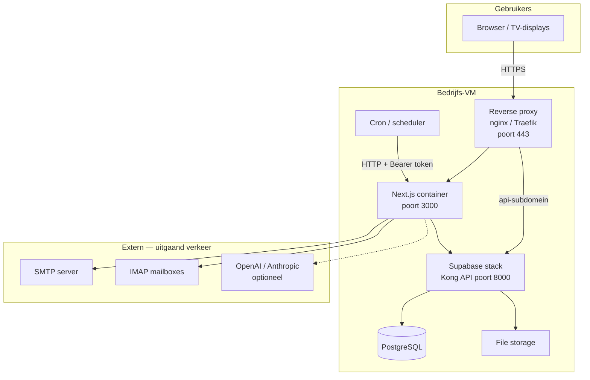

# Serveraanvraag IT — Prodwilrijk V2 (on-premise)

**Documentversie:** 1.0  
**Datum:** 1 juni 2026  
**Doel:** Specificatie voor IT om een productieserver op te zetten voor de interne warehouse-management applicatie **Prodwilrijk V2**.

---

## 1. Samenvatting

Prodwilrijk V2 is een webapplicatie (Next.js) met een **lokaal gehoste Supabase-stack** (PostgreSQL, authenticatie, file storage, API). De applicatie draait volledig **on-premise**; database en bestanden blijven op bedrijfsinfrastructuur.

| Component | Technologie | Hosting |
|-----------|-------------|---------|
| Webapplicatie | Next.js 16, Node.js 22 | Docker op VM |
| Backend / database | Supabase (self-hosted) | Docker op VM |
| Reverse proxy / TLS | nginx of Traefik | VM of bestaande load balancer |

**Ontwikkelteam** levert na serveroplevering: Docker-configuratie, database-migraties, omgevingsvariabelen en applicatie-deploy.  
**IT** levert: VM(s), netwerk, TLS, basis-OS, Docker-engine, backups, monitoring en toegang.

---

## 2. Architectuur



### Aanbevolen domeinen

| Subdomein | Doel | Backend |
|-----------|------|---------|
| `prodwilrijk.be` (of `app.prodwilrijk.be`) | Webapplicatie | Next.js (:3000) |
| `api.prodwilrijk.be` (of `supabase.prodwilrijk.be`) | Supabase API (browser + server) | Supabase Kong (:8000) |

> De Supabase-URL moet **publiek bereikbaar via HTTPS** zijn voor browsers (client-side JavaScript). PostgreSQL-poort **5432 mag niet** publiek openstaan.

---

## 3. Serverspecificaties

### Optie A — Eén VM (minimum)

Geschikt voor start / beperkt aantal gelijktijdige gebruikers.

| Resource | Minimum | Aanbevolen |
|----------|---------|------------|
| vCPU | 4 | 8 |
| RAM | 8 GB | **16 GB** |
| Schijf | 100 GB SSD | **250 GB SSD** |
| OS | Ubuntu 22.04 LTS of 24.04 LTS | idem |
| Backups | Dagelijks snapshot | + off-site kopie |

### Optie B — Twee VM's (productie-aanbevolen)

| VM | Rol | vCPU | RAM | Schijf |
|----|-----|------|-----|--------|
| VM 1 | Next.js + reverse proxy + cron | 2–4 | 4–8 GB | 50 GB SSD |
| VM 2 | Supabase (DB + storage) | 4–8 | 8–16 GB | 200+ GB SSD |

Supabase is I/O- en geheugengevoelig (PostgreSQL + foto-/documentopslag). Scheiding verbetert stabiliteit en backupbeleid.

---

## 4. Basissoftware (IT)

IT installeert en onderhoudt op de VM(s):

- [ ] **Linux** — Ubuntu 22.04/24.04 LTS (64-bit)
- [ ] **Docker Engine** — recente stabiele versie (24+)
- [ ] **Docker Compose plugin** — v2
- [ ] **Reverse proxy** — nginx of Traefik met TLS
- [ ] **Certificaat** — Let's Encrypt of intern PKI voor HTTPS
- [ ] **Tijdzone** — `Europe/Brussels`
- [ ] **NTP** — gesynchroniseerde klok (belangrijk voor cron/mail-import)
- [ ] **Firewall** — zie sectie 5
- [ ] **Backup-agent** — dagelijkse VM-snapshot + database-backup (sectie 10)

### Gebruiker / toegang

- [ ] SSH-toegang voor het ontwikkelteam (sleutel-gebaseerd, geen wachtwoordlogin)
- [ ] Eén service-account of `docker`-groep voor containerbeheer
- [ ] Sudo-rechten voor Docker-installatie en onderhoud (beperkt tot deploy-user indien mogelijk)

> **Niet nodig:** Node.js, PostgreSQL of Supabase direct op het OS installeren. Alles draait in containers.

---

## 5. Netwerk & firewall

### Inkomend (van internet / bedrijfsnetwerk naar server)

| Poort | Protocol | Bron | Bestemming | Opmerking |
|-------|----------|------|------------|-----------|
| 443 | TCP | Geautoriseerde clients | Reverse proxy | **Enige publieke poort** (aanbevolen) |
| 22 | TCP | IT / dev IP-range | VM | SSH-beheer, beperken tot vaste IP's |
| 80 | TCP | Optioneel | Reverse proxy | Alleen voor HTTP→HTTPS redirect |

### Niet publiek openzetten

| Poort | Dienst |
|-------|--------|
| 5432 | PostgreSQL |
| 6543 | Supabase connection pooler |
| 8000 | Supabase Kong (alleen via reverse proxy op 443) |
| 3000 | Next.js (alleen intern / via reverse proxy) |

### Uitgaand (van server naar extern)

De applicatie heeft **uitgaand internet** nodig voor:

| Doel | Poort | Protocol | Verplicht |
|------|-------|----------|-----------|
| SMTP (e-mail verzenden) | 587 of 465 | TCP | Ja |
| IMAP (mail-import jobs) | 993 | TCP | Ja |
| OpenAI API | 443 | HTTPS | Optioneel (AI-functies) |
| Anthropic API | 443 | HTTPS | Optioneel |
| OS/Docker updates | 443 | HTTPS | Ja |
| Let's Encrypt ACME | 443/80 | HTTPS | Ja (indien gebruikt) |

> Als mail via **interne** SMTP/IMAP-servers loopt, volstaan routes naar die interne hosts.

---

## 6. DNS & TLS

IT regelt:

- [ ] DNS A/AAAA-records voor applicatie-domein
- [ ] DNS A/AAAA-record voor Supabase API-subdomein (`api.prodwilrijk.be`)
- [ ] TLS-certificaat (geldig voor beide hostnames, bijv. SAN-certificaat of wildcard `*.prodwilrijk.be`)
- [ ] Automatische certificaatvernieuwing

Reverse proxy configuratie (richtlijn):

```
https://prodwilrijk.be          → http://127.0.0.1:3000   (Next.js)
https://api.prodwilrijk.be      → http://127.0.0.1:8000   (Supabase Kong)
```

WebSocket-ondersteuning inschakelen op de Supabase-route (Supabase Realtime).

---

## 7. Supabase (self-hosted)

### Wat Supabase omvat

Officiële self-hosted stack via Docker Compose:

- PostgreSQL database
- GoTrue (authenticatie)
- PostgREST (REST API)
- Realtime
- Storage (S3-compatible, lokale schijf)
- Kong API Gateway
- Supabase Studio (optioneel, alleen intern)

Referentie: [https://supabase.com/docs/guides/self-hosting/docker](https://supabase.com/docs/guides/self-hosting/docker)

### IT-acties voor Supabase

- [ ] Voldoende schijfruimte voor database **en** file storage (foto's, PDF's, documenten)
- [ ] Persistent Docker volumes voor database en storage (overleven container-restart)
- [ ] Supabase Studio **niet** publiek exposed; enkel via VPN of intern netwerk
- [ ] PostgreSQL-poort 5432 enkel op `localhost` / intern Docker-netwerk

### Storage buckets (via database-migraties)

Het ontwikkelteam provisioned buckets via SQL-migraties. Verwachte buckets o.a.:

- `item-images`
- `controle-fotos`
- `cnh-photos`
- `opslag-verhuur-photos`
- `airtec-incoming-label-photos`
- `saw-sharpening-attachments`
- `orderflow-documents`

Plan **minimaal 50–100 GB** extra schijfruimte voor file storage (afhankelijk van fotovolume).

### Geheimen (IT genereert of bewaart veilig)

Supabase self-hosting vereist o.a.:

- `POSTGRES_PASSWORD`
- `JWT_SECRET`
- `ANON_KEY` / `SERVICE_ROLE_KEY` (afgeleid van JWT secret)

Het ontwikkelteam configureert deze in Docker Compose; IT bewaart kopie in password vault.

---

## 8. Next.js applicatie

| Eigenschap | Waarde |
|------------|--------|
| Framework | Next.js 16 |
| Node.js | **22.x** (LTS) |
| Package manager | npm 10+ |
| Productie-start | `npm run build` → `npm run start` (poort 3000) |
| Container | Docker (Dockerfile wordt geleverd door dev team) |

### Omgevingsvariabelen (productie)

IT hoeft deze niet zelf in te vullen, maar moet weten dat de app een **beveiligd env-bestand** of **Docker secrets** nodig heeft:

```env
# Supabase (wijst naar lokale self-hosted instance)
NEXT_PUBLIC_SUPABASE_URL=https://api.prodwilrijk.be
NEXT_PUBLIC_SUPABASE_ANON_KEY=<door dev team ingevuld>
SUPABASE_SERVICE_ROLE_KEY=<door dev team ingevuld, geheim>

# Publieke site-URL
NEXT_PUBLIC_SITE_URL=https://prodwilrijk.be

# SMTP, IMAP, cron-secrets, AI-keys — zie .env.example in repository
```

`.env`-bestanden **nooit** in git committen.

---

## 9. Geplande taken (cron jobs)

Op Vercel draaien geplande HTTP-aanroepen naar API-routes. Op de eigen server vervangt IT of het dev team dit door een **cron scheduler** (host cron, `systemd` timer, of cron-container) die HTTPS-requests stuurt met:

```
Authorization: Bearer <CRON_SECRET>
```

### Te plannen endpoints

| Endpoint | Schema (UTC) | Beschrijving |
|----------|--------------|--------------|
| `GET /api/packed-items-airtec/send-daily-report` | `25 13 * * 1-4` | Airtec dagrapport (ma–do) |
| `GET /api/packed-items-airtec/send-daily-report` | `25 12 * * 5` | Airtec dagrapport (vrijdag) |
| `GET /api/grote-inpak/pils-mail-import` | `2 5 * * *` | PILS mail import |
| `GET /api/grote-inpak/pils-mail-import` | `5 10 * * *` | PILS mail import |
| `GET /api/grote-inpak/pils-mail-import` | `5 14 * * *` | PILS mail import |
| `GET /api/grote-inpak/packed-mail-import` | `2 14 * * *` | Packed mail import |
| `GET /api/grote-inpak/kist-mail-import` | `*/10 * * * *` | Kist mail import (elke 10 min) |
| `GET /api/grote-inpak/forecast-mail-import` | `7,22,37,52 * * * *` | Forecast mail import |
| `GET /api/lumipaper/mail-import` | `*/10 * * * *` | Lumipaper mail import |

> Bovenstaande tijden zijn **UTC** (zoals op Vercel). Bij cron op de server: converteer naar `Europe/Brussels` of behoud UTC expliciet.

Voorbeeld cron-regel (host):

```bash
*/10 * * * * curl -fsS -H "Authorization: Bearer $CRON_SECRET" \
  "https://prodwilrijk.be/api/grote-inpak/kist-mail-import" >> /var/log/prodwilrijk-cron.log 2>&1
```

**IT-actie:** cron-omgeving voorzien (cron daemon of container) met toegang tot HTTPS endpoint en geheim token (via env var, niet hardcoded in crontab).

---

## 10. Backups & disaster recovery

### Verplicht

| Wat | Frequentie | Retentie | Opmerking |
|-----|------------|----------|-----------|
| VM snapshot | Dagelijks | Min. 30 dagen | Volledige rollback |
| PostgreSQL dump | Dagelijks | Min. 30 dagen | `pg_dump` of Supabase backup |
| Storage volumes | Dagelijks | Min. 30 dagen | Supabase storage map / volume |
| Off-site kopie | Dagelijks/wekelijks | Min. 90 dagen | Andere locatie dan productie-VM |

### Aanbevolen

- [ ] Test restore **minimaal 1× per kwartaal**
- [ ] Monitoring/alerts bij schijfruimte < 20%
- [ ] Monitoring/alerts bij container crash / health check failure

### RTO / RPO (richtlijn bespreken met IT)

| | Richtwaarde |
|---|-------------|
| RPO (maximaal dataverlies) | 24 uur |
| RTO (maximale downtime) | 4 uur |

---

## 11. Monitoring & logging

| Item | Actie IT |
|------|----------|
| Container health | Docker restart policy (`unless-stopped`) |
| Schijfgebruik | Alert bij > 80% |
| RAM/CPU | Alert bij sustained > 85% |
| Logs | Centraliseer nginx-, app- en cron-logs (retentie min. 30 dagen) |
| Uptime | Externe of interne health check op `https://prodwilrijk.be` |

---

## 12. Beveiliging

- [ ] SSH: alleen key-based auth, root login uit
- [ ] Firewall: default deny, alleen 443 (+ 22 vanaf vaste IP's)
- [ ] Automatische security updates OS (of patchvenster afspreken)
- [ ] `SUPABASE_SERVICE_ROLE_KEY` en `CRON_SECRET`: nooit in logs of git
- [ ] Supabase Studio: enkel intern/VPN
- [ ] Rate limiting op reverse proxy (optioneel, tegen brute force)
- [ ] Scheid productie-secrets van development-secrets

---

## 13. Verantwoordelijkheden

| Taak | IT | Ontwikkelteam |
|------|:--:|:--------------:|
| VM provisioning | ✅ | |
| Docker Engine installatie | ✅ | |
| Firewall / DNS / TLS | ✅ | |
| Backups & restore-test | ✅ | |
| SSH-toegang dev team | ✅ | |
| Supabase Docker Compose | | ✅ |
| Next.js Docker Compose | | ✅ |
| Database-migraties | | ✅ |
| Env-variabelen / secrets invullen | | ✅ |
| Cron job configuratie | ✅ * | ✅ * |
| Applicatie-deploy & updates | | ✅ |
| Functionele acceptatietest | | ✅ |

\* Afspreken wie cron instelt; IT levert scheduler, dev team levert exacte commando's en secrets.

---

## 14. Opleveringschecklist IT

Vóór overdracht aan het ontwikkelteam:

- [ ] VM(s) operationeel met specificaties uit sectie 3
- [ ] Ubuntu LTS geïnstalleerd, timezone `Europe/Brussels`
- [ ] Docker + Docker Compose werkend (`docker run hello-world` OK)
- [ ] SSH-toegang voor dev team (keys geregistreerd)
- [ ] DNS-records actief
- [ ] TLS-certificaat geïnstalleerd op reverse proxy
- [ ] Reverse proxy routes klaar (proxy naar :3000 en :8000)
- [ ] Firewall-regels toegepast (sectie 5)
- [ ] Uitgaand verkeer SMTP/IMAP/HTTPS toegestaan
- [ ] Backup-schedule actief
- [ ] Persistent volumes / data-partities aangemaakt
- [ ] Documentatie: VM IP's, hostnames, SSH-users, backup-locatie

### Info doorgeven aan dev team

```
VM IP:         ___________________
SSH user:      ___________________
Hostname app:  prodwilrijk.be
Hostname API:  api.prodwilrijk.be
Reverse proxy: nginx / Traefik / ___
Backup locatie: ___________________
```

---

## 15. Migratie van bestaande omgeving

Indien er reeds data in **Supabase Cloud** staat:

1. IT levert server (dit document)
2. Dev team zet self-hosted Supabase op
3. Dev team migreert database + storage van cloud naar on-premise
4. DNS wordt omgezet naar nieuwe server
5. Vercel-productie wordt uitgefaseerd

> IT hoeft de datamigratie niet uit te voeren; enkel server en netwerk klaarzetten vóór cutover.

---

## 16. Contact & vervolg

| Rol | Naam | E-mail |
|-----|------|--------|
| Applicatie-eigenaar | | |
| Ontwikkelaar | | |
| IT contact | | |

**Na oplevering server:** ontwikkelteam plant een deploy-sessie (geschatte duur: 1 werkdag voor initiele setup + test).

---

## Bijlage A — Technische stack (referentie)

- Next.js 16, React 19, TypeScript
- Supabase JS client 2.x
- PostgreSQL (via Supabase)
- Authenticatie via Supabase Auth
- File uploads via Supabase Storage
- E-mail: Nodemailer (SMTP uitgaand) + IMAP imports
- Optionele AI-integratie: OpenAI / Anthropic API's

## Bijlage B — Repository

Broncode en database-migraties:

```
Repository: prodwilrijk-v2
Migraties:  supabase/migrations/
Env-voorbeeld: .env.example
```

---

*Dit document beschrijft infrastructuurvereisten. Docker-bestanden (`Dockerfile`, `docker-compose.yml`) worden door het ontwikkelteam geleverd na serveroplevering.*
