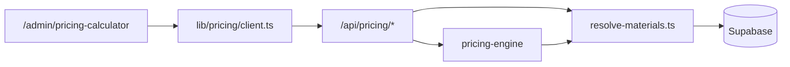

# Prijscalculator — volledige context voor uitbreiding

**URL productie:** https://prodwilrijk.be/admin/pricing-calculator  
**Stack:** Next.js App Router, Supabase, Tailwind, AdminGuard  
**Status MVP:** alleen producttype `PALLET` is volledig werkend; CRATE/CARTON/COMBI/CUSTOM zijn stubs.

---

## Architectuur



**Belangrijk:**
- Kostprijzen (`cost_per_unit`) komen **alleen** uit `pricing_materials` op de server — nooit uit de browser.
- Berekening via `POST /api/pricing/calculate`.
- Simulaties opslaan in `pricing_simulations` via `POST /api/pricing/simulations`.

---

## Bestandsstructuur

```
app/admin/pricing-calculator/page.tsx     ← hoofdpagina UI
app/admin/pricing-simulations/page.tsx    ← historiek lijst
app/admin/pricing-simulations/[id]/page.tsx

components/pricing/PalletDimensionsForm.tsx
components/pricing/PricingResultCard.tsx

lib/pricing/client.ts                     ← frontend API calls
lib/pricing/calculate-request.ts
lib/pricing/resolve-materials.ts
lib/pricing/api-helpers.ts
lib/pricing/simulation-number.ts

lib/pricing-engine/index.ts
lib/pricing-engine/pallet-calculator.ts
lib/pricing-engine/pallet-dimensions.ts
lib/pricing-engine/types.ts
lib/pricing-engine/utils.ts
lib/pricing-engine/stub-calculator.ts

app/api/pricing/product-types/route.ts
app/api/pricing/plants/route.ts
app/api/pricing/materials/route.ts
app/api/pricing/operations/route.ts
app/api/pricing/rules/route.ts
app/api/pricing/calculate/route.ts
app/api/pricing/simulations/route.ts
app/api/pricing/simulations/[id]/route.ts

supabase/migrations/20260527_pricing_calculator.sql
supabase/migrations/20260528_pricing_materials_category.sql
```

---

## Prijsformule (PALLET)

```
materiaalkost = Σ (aantal pallets × volume_m³_per_onderdeel × kost/m³ houtsoort)
arbeidskost   = aantal × (minuten_per_stuk / 60) × €/uur
extra_kost    = Σ (aantal × qty_per_stuk × kost_per_eenheid uit DB)
basis         = materiaal + arbeid + extra + transport
overhead      = basis × overhead%
totale_kost   = basis + overhead
marge         = totale_kost × marge%
verkoopprijs  = totale_kost + marge
prijs/stuk    = verkoopprijs / aantal
```

Volume per onderdeel: `(L×B×D mm) / 10⁹ × aantal stuks per pallet`

---

## API endpoints

| Method | Route | Doel |
|--------|-------|------|
| GET | `/api/pricing/product-types` | PALLET, CRATE, … |
| GET | `/api/pricing/plants?` | WILRIJK, GENK, GENT |
| GET | `/api/pricing/materials?plant_id=&category=houtsoort\|extra` | Geen cost in response? (check route) |
| POST | `/api/pricing/calculate` | `{ product_type_code, input, plant_id }` → `{ result }` |
| POST | `/api/pricing/simulations` | Opslaan draft |
| GET | `/api/pricing/simulations` | Lijst |
| GET | `/api/pricing/simulations/[id]` | Detail |

**Calculate input (PALLET):**
```json
{
  "product_type_code": "PALLET",
  "plant_id": "uuid",
  "input": {
    "quantity": 100,
    "wood_material_id": "uuid",
    "dimensions": {
      "pallet_length_mm": 1200,
      "pallet_width_mm": 800,
      "components": {
        "onderplanken": { "count": 5, "length_mm": 1200, "width_mm": 100, "thickness_mm": 22 },
        "bovenplanken": { "count": 5, "length_mm": 1200, "width_mm": 145, "thickness_mm": 22 },
        "blokken": { "count": 9, "length_mm": 145, "width_mm": 100, "thickness_mm": 78 },
        "tussenplanken": { "count": 0, "length_mm": 1200, "width_mm": 100, "thickness_mm": 15 }
      }
    },
    "extra_materials": [{ "material_id": "uuid", "quantity_per_unit": 1 }],
    "labor_minutes_per_unit": 12,
    "labor_cost_per_hour": 45,
    "transport_cost": 150,
    "overhead_percentage": 8,
    "margin_percentage": 15
  }
}
```

---

## Database (kern)

- `pricing_product_types` — PALLET, CRATE, CARTON, COMBI, CUSTOM
- `pricing_plants` — WILRIJK, GENK, GENT
- `pricing_materials` — `category`: houtsoort (€/m³) | extra (€/st, m, …) | overig
- `pricing_operations` — uurloon per bewerking (nog niet in UI)
- `pricing_rules` — JSON config per plant/product (toekomst)
- `pricing_simulations` — input_data + result_data JSONB

---

## HOOFDPAGINA — `app/admin/pricing-calculator/page.tsx`

```tsx
'use client'

import { useCallback, useEffect, useMemo, useState } from 'react'
import Link from 'next/link'
import AdminGuard from '@/components/AdminGuard'
import PalletDimensionsForm from '@/components/pricing/PalletDimensionsForm'
import PricingResultCard from '@/components/pricing/PricingResultCard'
import { defaultPalletDimensions, type PalletDimensionsInput } from '@/lib/pricing-engine/pallet-dimensions'
import type { PricingResult } from '@/lib/pricing-engine/types'
import {
  calculatePriceApi,
  fetchMaterials,
  fetchPlants,
  fetchProductTypes,
  formatEuro,
  saveSimulation,
  type PricingMaterialOption,
  type PricingMasterOption,
} from '@/lib/pricing/client'
import { Calculator, History, Loader2, Plus, Trash2 } from 'lucide-react'

interface ExtraLineForm {
  key: string
  material_id: string
  quantity_per_unit: string
}

const defaultForm = {
  customer_name: '',
  quantity: '100',
  wood_material_id: '',
  labor_minutes_per_unit: '12',
  labor_cost_per_hour: '45',
  transport_cost: '150',
  overhead_percentage: '8',
  margin_percentage: '15',
}

function newExtraLine(): ExtraLineForm {
  return { key: `e-${Date.now()}-${Math.random()}`, material_id: '', quantity_per_unit: '1' }
}

export default function PricingCalculatorPage() {
  const [plants, setPlants] = useState<PricingMasterOption[]>([])
  const [productTypes, setProductTypes] = useState<PricingMasterOption[]>([])
  const [woodTypes, setWoodTypes] = useState<PricingMaterialOption[]>([])
  const [extraCatalog, setExtraCatalog] = useState<PricingMaterialOption[]>([])
  const [plantId, setPlantId] = useState('')
  const [productTypeId, setProductTypeId] = useState('')
  const [form, setForm] = useState(defaultForm)
  const [dimensions, setDimensions] = useState<PalletDimensionsInput>(defaultPalletDimensions)
  const [extraLines, setExtraLines] = useState<ExtraLineForm[]>([newExtraLine()])
  const [loadingMaster, setLoadingMaster] = useState(true)
  const [loadingMaterials, setLoadingMaterials] = useState(false)
  const [calculating, setCalculating] = useState(false)
  const [saving, setSaving] = useState(false)
  const [error, setError] = useState<string | null>(null)
  const [result, setResult] = useState<PricingResult | null>(null)
  const [savedNumber, setSavedNumber] = useState<string | null>(null)

  const selectedProduct = useMemo(
    () => productTypes.find((p) => p.id === productTypeId),
    [productTypes, productTypeId],
  )

  const isPallet = selectedProduct?.code === 'PALLET'

  // ... laadt plants/productTypes, materials per plant
  // buildInput() → calculatePriceApi → PricingResultCard
  // saveSimulation() → pricing_simulations
}
```

*(Volledige 428 regels staan in het projectbestand; hier ingekort voor leesbaarheid — open het bestand voor 100% code.)*

---

## UI-onderdelen pagina

1. **Plant + producttype** (dropdowns)
2. **Klantnaam**
3. **Standaard houtsoort** (`pricing_materials` category=houtsoort)
4. **PalletDimensionsForm** — onderplanken, tussenplanken, blokken, bovenplanken (mm + optioneel eigen hout)
5. **Extra materialen** — dynamische regels (materiaal + hoeveelheid/stuk)
6. **Aantal, arbeid, transport, overhead %, marge %**
7. Knoppen: **Bereken prijs** | **Simulatie opslaan**
8. **PricingResultCard** — breakdown rechts

---

## `components/pricing/PalletDimensionsForm.tsx`

Formulier voor 4 onderdelen met count/L/B/D/houtsoort + volume-preview (m³/pallet).

---

## `components/pricing/PricingResultCard.tsx`

Toont: pricePerUnit, salesPrice, kostenposten, breakdown-tabel.

---

## `lib/pricing-engine/pallet-calculator.ts`

Kernberekening — zie projectbestand (149 regels).

---

## `lib/pricing/resolve-materials.ts`

Laadt `pricing_materials` by id, koppelt hout per component + extras.

---

## Mogelijke uitbreidingen (ideeën voor Claude)

- [ ] CRATE / CARTON calculators implementeren
- [ ] Admin UI masterdata materialen (nu alleen SQL seeds)
- [ ] `pricing_operations` koppelen (uurloon uit DB i.p.v. handmatig veld)
- [ ] BC-sync `cost_per_unit`
- [ ] PDF/offerte export per simulatie
- [ ] Klant-selectie uit BC
- [ ] Regels per plant (`pricing_rules.rule_config`)
- [ ] Dupliceer simulatie / vergelijk scenario's
- [ ] Validatie min/max marges

---

## Open bestanden in project (kopieer 1-op-1 naar Claude)

| Prioriteit | Pad |
|------------|-----|
| 1 | `app/admin/pricing-calculator/page.tsx` |
| 2 | `components/pricing/PalletDimensionsForm.tsx` |
| 3 | `components/pricing/PricingResultCard.tsx` |
| 4 | `lib/pricing/client.ts` |
| 5 | `lib/pricing-engine/pallet-calculator.ts` |
| 6 | `lib/pricing-engine/pallet-dimensions.ts` |
| 7 | `lib/pricing/resolve-materials.ts` |
| 8 | `lib/pricing/calculate-request.ts` |
| 9 | `app/api/pricing/calculate/route.ts` |
| 10 | `supabase/migrations/20260527_pricing_calculator.sql` |
| 11 | `supabase/migrations/20260528_pricing_materials_category.sql` |

---

*Gegenereerd voor uitbreiding pricing-calculator — Prodwilrijk V2*
